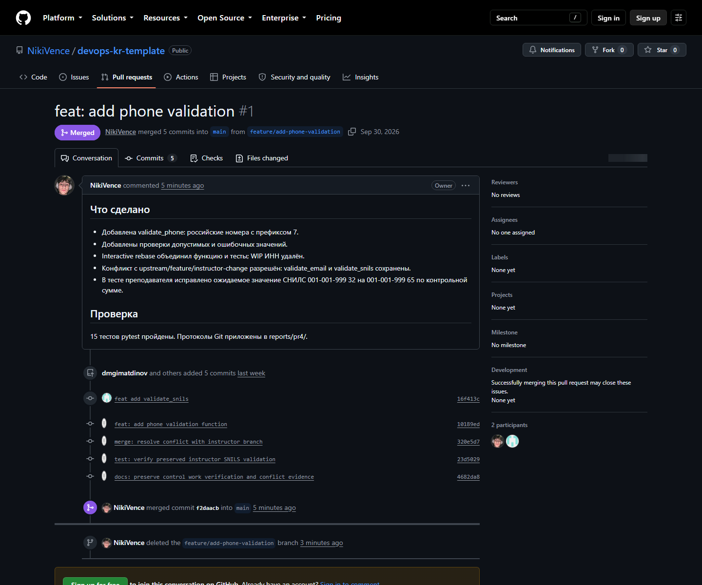
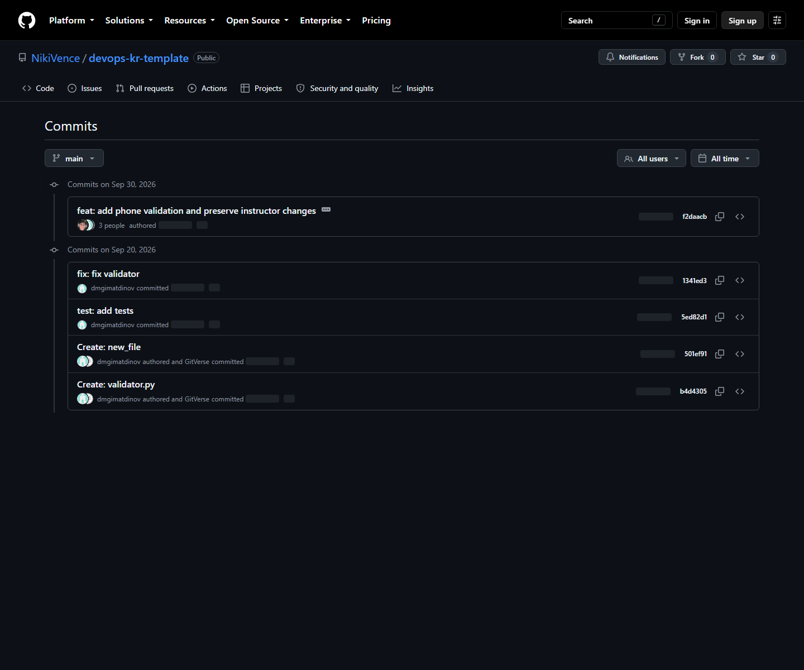

# Практическая работа №4

**Тема:** Контрольная работа №1. Комплексное применение Git и Gitverse

**Дисциплина:** Инструменты DevOps

**Выполнил:** Алиев Никита Денисович, ЭФБО-01-24

**Преподаватель:** Гиматдинов Дамир Маратович

**ИПТИП · Кафедра индустриального программирования · 2026/2027**

## 1. Цель и исходный проект

Комплексно применить fork/import, несколько remote, feature-ветку,
interactive rebase, разрешение конфликта и Pull Request.
Исходник: https://gitverse.ru/dgimatdinov/devops-kr-template.
Начальный коммит `1341ed3`, ветка преподавателя `16f413c`.
Фактическая основная ветка исходника — master; локальная учебная — main.

## 2. Настройка remote

Подготовлены origin для своей копии, upstream для исходника и mirror
для зеркала. Вместо опечатки `git@https://...` из методички использован
корректный HTTPS-адрес. Для origin указаны оба адреса отправки явно.

## 3. Функциональность и исходная история

Добавлена validate_phone: после удаления пробелов и дефисов допускаются
`+7` или `7` и десять ASCII-цифр. Номер с началом `8` отклоняется.
Созданы отдельные коммиты функции, тестов, WIP-заготовки validate_inn
и исправления опечатки. Для точной проверки всей строки применён fullmatch.

## 4. Очистка истории

Interactive rebase оставил первый коммит, присоединил тесты и исправление
через fixup и удалил WIP через drop. Функции validate_inn в результате нет.
Истории сохранены в тегах evidence/kr-dirty и evidence/kr-clean.

## 5. Конфликт с преподавателем

Слияние upstream/feature/instructor-change вызвало конфликт validator.py.
При разрешении сохранены обе новые функции — validate_phone и validate_snils,
а также исходная validate_email. Маркеры конфликта удалены.

В тесте преподавателя исправлены контрольные цифры примера
`001-001-999 32` на `001-001-999 65`: сумма с весами от 9 до 1 равна 65.
Исправлено ожидаемое значение, реализация функции преподавателя сохранена.

## 6. Проверка

Команда запуска: `..\.venv\Scripts\python.exe -m pytest -v` из папки проекта.
Проверены допустимые и ошибочные номера телефона, email и контрольная сумма
СНИЛС. Повторная проверка 30.09.2026: 15 тестов пройдены.

## 7. Pull Request и синхронизация

Импорт выполнен в https://github.com/NikiVence/devops-kr-template
с сохранением истории преподавателя. Зеркало:
https://github.com/NikiVence/devops-kr-mirror.
Для зеркала использован GitHub вместо предложенных GitLab/Gitverse;
команды multi-remote и проверка синхронизации выполняются тем же способом.

PR https://github.com/NikiVence/devops-kr-template/pull/1 объединён через
Squash and merge. Код задания вошёл одним коммитом f2daacb.
Учебная feature-ветка удалена на обоих серверах после объединения.
Локальная main обновлена; одна команда push отправила её в оба remote.
Равенство хешей main проверено через git ls-remote.

## 8. Вывод

Реализован валидатор телефона с тестами, выполнен rebase с fixup/drop,
осмысленно разрешён конфликт с преподавателем. Функциональность обеих сторон
сохранена. Проверки и история подтверждают локальную часть контрольной.
Публикация и итоговое слияние оцениваются по статусу в разделе 7.
